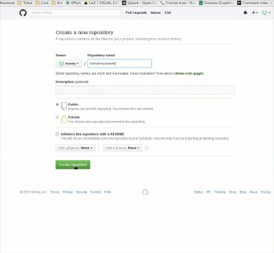

# Tutoriel git avec Github
==========================

## Préparation
--------------

1. Créer un compte sur [Github](https://github.com)

2. Créer un dépôt sur Github : 

3. Ouvrir un terminal sur son ordinateur

4. Créer un répertoire : `mkdir yourdirectoryname`

5. Se placer dans le répertoire : `cd yourdirectoryname`

## Initialisation

La première étape c'est de créer un dossier caché `.git` qui contiendra toute la configuration de notre répertoire et qui va s'occuper de gérer nos versions.

Heureusement, on n'a pas besoin de créer tout ça nous même, il suffit juste de taper `git init`, et `git` va se charger de créer tout ça pour nous.

A partir de là, on va devoir donner à la config le lien de notre dépôt : 

`git remote add origin https://github.com/<yourusername>/<yourdirectoryname>.git`

La commande `git remote` permet de gérer les différents dépôts. L'option `add` permet d'ajouter un repo.

`origin` est le nom que l'on donne à notre dépôt. On peut mettre ce qu'on veut, l'important est juste de s'en rappeler. 

La pratique courante veut tout de même que l'on mette `origin` lorsque l'on gère notre projet sur un seul repo.

## Ajouter des modifications

On crée d'abord un fichier : `nano readme.txt` dans lequel on écrit ce que l'on veut (`CTRL + C` et `y` ou `o` pour valider).

Ensuite on va indiquer à git que l'on a ajouté des modifications à ce fichier et que l'on veut l'envoyer sur notre dépôt : `git add readme.txt`.

On tape ensuite `git commit -m "J'ai ajouté le fichier readme.txt"` : ça a pour effet de rajouter un message, visible par les autres utilisateurs du repo, qui va leur permettre de savoir quels changements on a effectué.

## Pousser les modifications

Pour l'instant tous nos changements sont faits en local, donc ils ne sont pas visibles sur notre dépôt.

Pour qu'ils soient visibles, il faut "pusher" nos modifs sur le repo grâce à la commande `git push origin master`.

La commande `git push` prend deux arguments : le nom du repo tel qu'on a configuré (donc ici `origin`) et la branche sur laquelle on veut pusher les modifications (`master`).

Après avoir fait ça, si on va sur notre dépôt, on verra les modifications apportées

## Récupérer les modifications

Quand on bosse à plusieurs, il faut penser à régulièrement "pull" le repo pour avoir les modifications des autres et pour éviter de travailler trop longtemps sur une version pas à jour.

Pour "puller", on tape `git pull origin master`. C'est le même principe que push sauf que cette fois on envoie pas de modifications mais on récupère les modifications.

Si des modifications ont été apportées au repo et que notre branche n'est pas à jour, git va nous le signaler et on devra effectuer un `git pull` avant de pouvoir faire un `git push`.

## Les branches

// TODO

## Les merges

